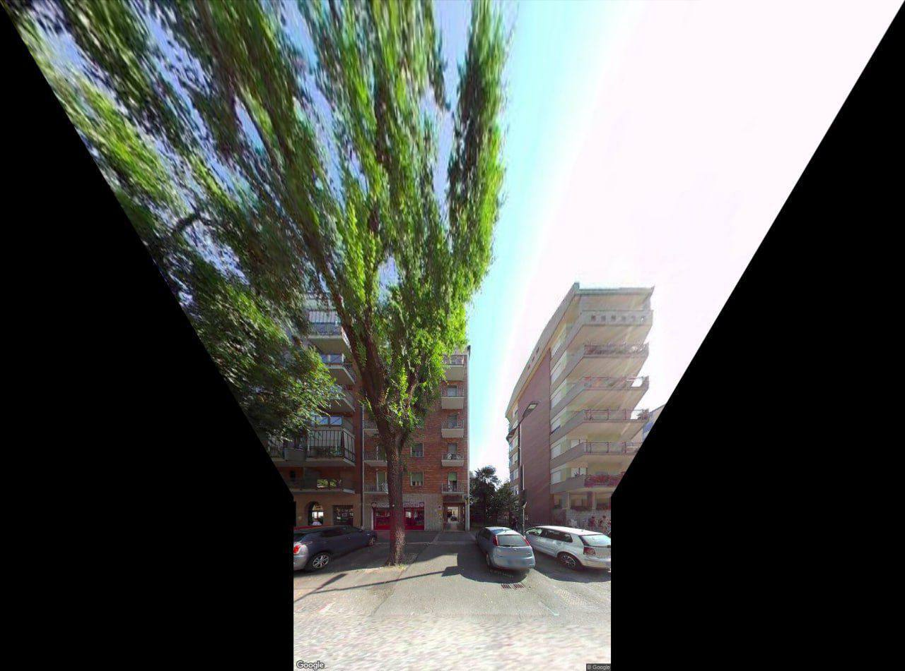
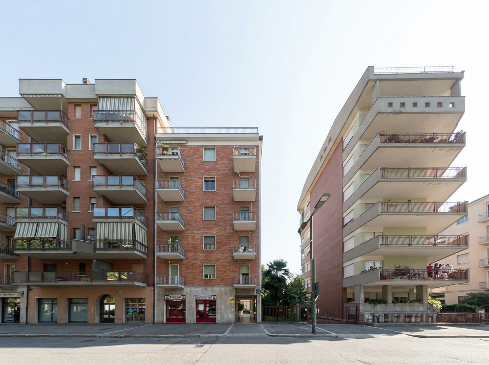
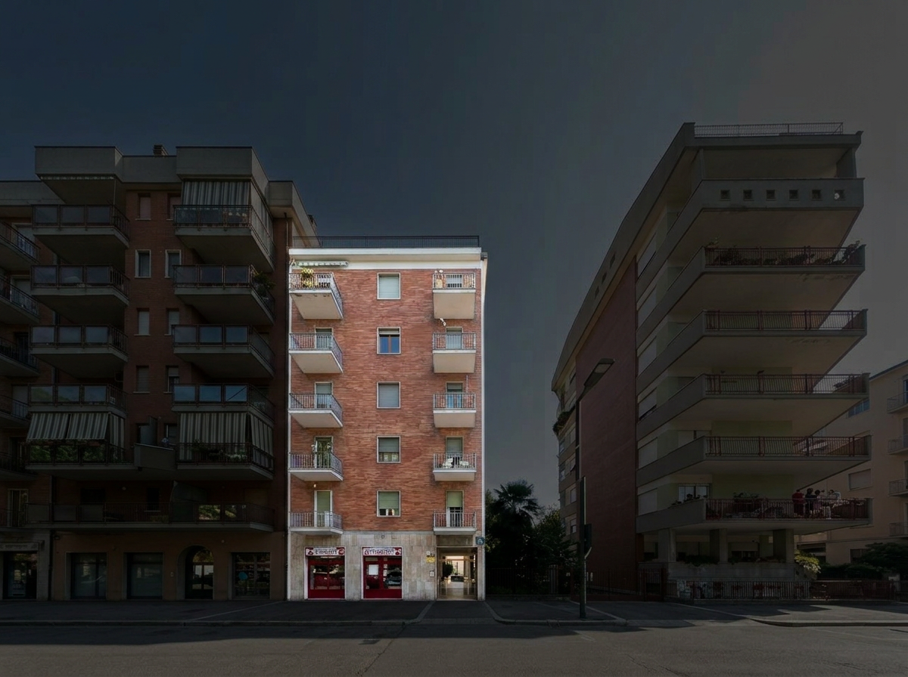
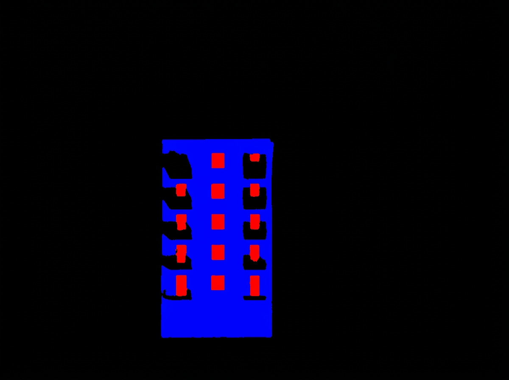
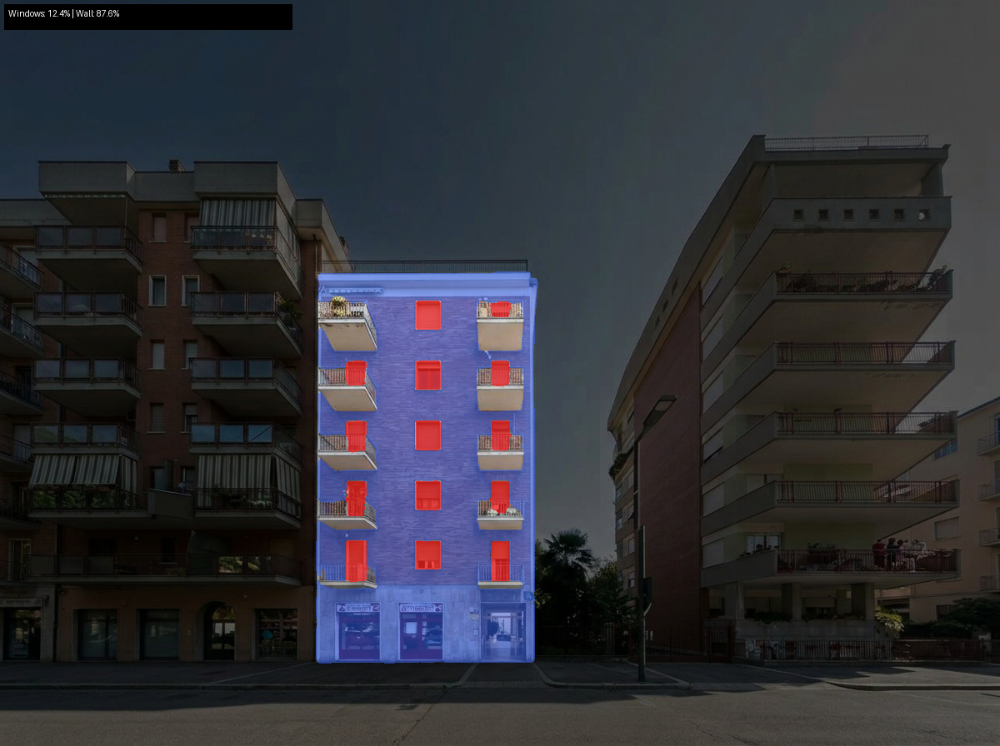

# Building Window Analysis

Estimate the window-to-wall ratio of building facades from Google Maps street view photos — for energy efficiency analysis.

Works even with bad perspectives, trees, and cars blocking the view.

## Pipeline

3 Gemini API calls, each independently testable:

| Step | What it does | Output |
|------|-------------|--------|
| **Step 1** — Clean | Remove trees, cars, obstructions | Clean photo of the buildings |
| **Step 2** — Select | Darken everything except the target building | Isolated building at full brightness |
| **Step 3** — Mask | Generate window (red) + wall (blue) segmentation mask | Flat color mask for pixel counting |

Then **pixel math** counts red vs blue pixels → window/wall ratio.

## Example

### Input
Google Maps street view — bad panoramic stitch, huge tree blocking the center building:



### Step 1 — Remove obstructions
Trees and cars removed, buildings revealed:



### Step 2 — Select center building
Everything dimmed except the target building:



### Step 3 — Segmentation mask
Red = windows, Blue = opaque wall, Black = everything else:



### Result
Overlay visualization with final ratio:



**Windows: 12.4% | Wall: 87.6%**

## Setup

```bash
# Install uv (if you don't have it)
curl -LsSf https://astral.sh/uv/install.sh | sh

# Install dependencies
uv sync

# Set your Gemini API key
export GEMINI_API_KEY="your-key-here"
```

## Usage

```bash
# Full pipeline (clean → select → mask → result)
uv run run_pipeline.py photo.jpg [output_dir]

# Or run steps individually for testing:
uv run step1_clean.py input.jpg step1_output.png
uv run step2_select.py step1_output.png step2_output.png
uv run step3_mask.py step2_output.png step3_mask.png
```

## Output files

- `step1_output.png` — cleaned photo (obstructions removed)
- `step2_output.png` — center building isolated (rest dimmed)
- `step3_mask.png` — segmentation mask (red=windows, blue=wall)
- `result.png` — visualization overlay with ratio

## Requirements

- Python 3.12+
- [Google Gemini API key](https://ai.google.dev/) (uses `gemini-3.1-flash-image-preview`)
- ~$0.01 per image (3 Gemini Flash API calls)

## Tech Stack

- **Gemini 3.1 Flash Image Preview** — image editing + mask generation
- **Pillow** — image I/O
- **NumPy** — pixel counting
- **uv** — Python package management
